# GroovyGravity

Hello, I'll document my progress here for future reference

## 17/06
Started the project, used parts of my Ocean Simulation to get a quickstart, and managed to draw a sphere
using the following sources, and some help from a friend:
- https://learnopengl.com/Getting-started/Hello-Triangle
- http://www.songho.ca/opengl/gl_sphere.html

Then, I added in a mesh that i took from OceanSim, for now I'll just draw it statically. And I extract what's common in a 
Drawable abstract class

## 21/06 
### Cleanup from last time
Today I would like to get the curvature of spacetime to work. I first started by putting the color information of the objects
in the vertices directly, rather than relying on a uniform to switch over different colors. I also fixed a bug with the sphere
generation, basically I noticed that when i placed a sphere not in the center, it had lines going to the origin. It was due to the
fact that I had gotten the boundary conditions wrong when generating the vertices.

### Rendering spacetime
Then, I started reading wikipedia ([spacetime](https://en.wikipedia.org/wiki/Spacetime#), [curved spacetime](https://en.wikipedia.org/wiki/Curved_spacetime#))
to get some information on how I could render spacetime like you see often rendered, as a sort of paraboloid.
This was wayy to complicated, but I remembered I had once seen a [youtube video](https://www.youtube.com/watch?v=_YbGWoUaZg0) of a guy that simulated gravity,
so I went and rewatched it. Turns out what I am trying to render is a Flamm paraboloid. Knowing this, I searched [wikipedia](https://en.wikipedia.org/wiki/Schwarzschild_metric#Flamm's_paraboloid)
I still couldn't, from the wikipedia article, figure out how I could turn this into code. I decided to go watch a [video](https://www.youtube.com/watch?v=qbU6WcWrHO4) to try to understand a bit more

This video seems perfect, it's telling me how to represent the paraboloid: 
$z(x, y) = 2 \sqrt{r_S(\sqrt{x^2 + y^2} - r_S)}$, where $r_S = 2GM/c^2$

### Multiple shaders
But then I'm running into another issue. Currently, I am rendering both spacetime and the objects with the same shader.
This is annoying because they require different behavior, but need information from each other.
I will try to implement multiple shader files and see how that goes. For now, it looks like I need only to have different
vertex shaders, but the fragment shaders can be the same. 

It looks like it's as simple as just using the different shader. The fact that I have this extracted really helps.

### Back to rendering spacetime
Ok, so now let's try to implement this formula. It looks like: per object, we will need to send to the spaceTimeShader (using uniforms):
- Mass
- Position

I think we will consider only objects that are at y=0 for now (I mean only objects that are sitting on the plane). Also, something
we need to be careful of is that the $z$ axis in OpenGL is not the same as the $z$ axis of the formula. We need to swap the $z$ and $y$ axes.

So, we can fit mass + position into one vec3 vector per object.
I implemented it, but it doesn't render any different. Tried with different values for the mass, used the mass of the sun
but it doesn't move. I'll test to run the loop in a test.cpp to see, maybe the values are just super small.
Aaahh, there appears to be an overflow due to the speed of light squared: 
```
GroovyGravity/src/test.cpp:12:30: warning: overflow in expression; result is -1'394'772'636 with type 'int' [-Winteger-overflow]
float c2 = 299792458 * 299792458;
```
Hmm, now it outputs a NaN, even when using doubles. Aha, the result here is negative: $r_S(\sqrt{x^2 + y^2} - r_S)$, so it can't be 
square rooted. Yeah, well  the argument can only be positive if $\sqrt{x^2 + y^2} > r_S$, and with the sun, $r_s$ is 2954.28, so that's not good...

Aahhh, this is because Flamm's paraboloid is only valid for regions outside of the event horizon. I guess either we scale down the objects, or we scale our simulation up.
But the Sun doesn't have an event horizon, its radius is directly larger than what would be the event horizon. That's weird because the radius
of the object does not appear in the formula. For now let's scale down then. Say we have a mesh for spacetime of 300x300,
and we want $r_S$ = 5. So, we need a mass that is 

$mass = c^2 r_S/2G = 3.36648 * 10^{27}$

Didn't have time to finish solving this today, so i'll continue next time

## 22/06
It is possible that the formula I have is not suited for objects that do not have an even horizon, i don't know.

Hmm, when i send the object to the shader, the object itself is no longer drawn. If we pass by reference it works.

I don't understand, because it seems like only the point at {0, 0} is being passed through the spaceTimeShader.
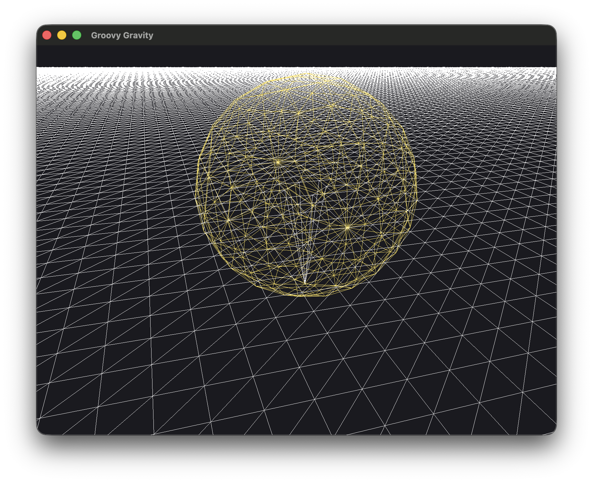
This is with this code in spaceTime.vert:
```c++
for (int i = 0; i < 1; i++) {
    // r_S = 2GM/c^2
    float G = 6.6743 * pow(10, -11);
    double c2 = 299792458 * 299792458;
    double rs =  2 * G * objects[i].x / c2;
    float x2 = aPos[0] * aPos[0];
    float y2 = aPos[2] * aPos[2];
    if ((sqrt(x2 + y2) - rs) > 0) { // means we are outside of the event horizon
        offset -= vec3(0, 2 * sqrt(rs * (sqrt(x2 + y2) - rs)), 0);
    } else { // Otherwise, we will offset a certain value i suppose
        offset -= vec3(0, 5, 0);
    }
}
```
I thought it could have been because we need to reference aPos.x, and not aPos[0], but apparently not..

When i remove the if check, and always offset by 5, it works, and I also notice that the FPS is much better (this part could be
because there is no if anymore). Maybe it is because of the presence of the if statement (gpu doesn't like it? I know they don't like
branching but come on, just a little bit of branching). But when i have an if statement outside
of a for loop, it seemed to work. I'll try removing the for loop for now.

Doesn't solve it, but at least that means that we'll be able to use our for loop later.

I tried coloring the vertices with respect to their distance to the origin. My goal was to color vertices that 
are close to {0, 0} in black, and far from {0, 0} go to red. It seems like it's working, the pixel in the very center is black (barely visible)
```c++
double distanceToOrigin = sqrt(x2 + y2);
vec3 c = vec3(1.0, 0, 0) * vec3(1 - 1/(distanceToOrigin + 1));
```
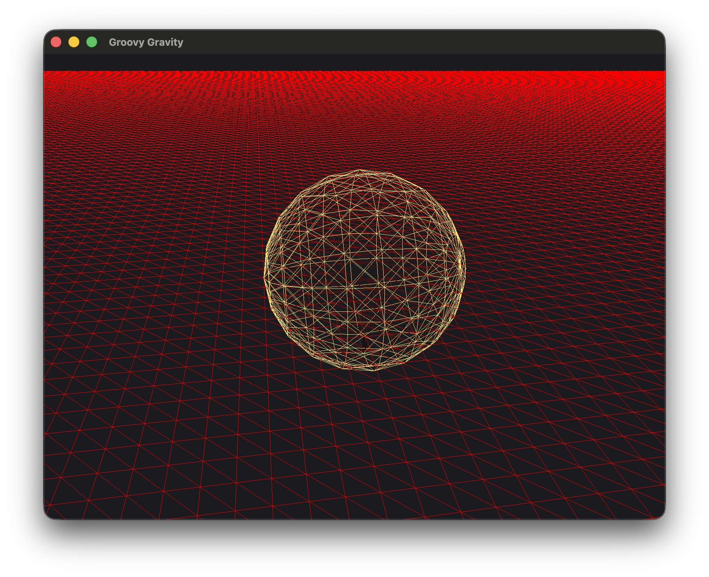
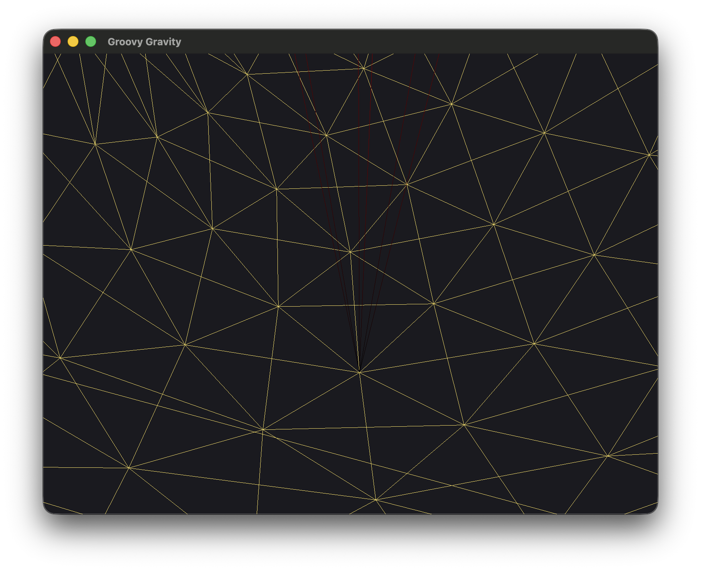
Hm but it does work apparently, because when I change the color to green when it enters the if, it works
```c++
if (distance > 0) { // means we are outside of the event horizon
    offset -= vec3(0, 2 * sqrt(rs * distance), 0);
    c = vec3(0.0, 1.0, 0.0);
} else { // Otherwise, we will offset a certain value i suppose
    offset -= vec3(0, 5.0, 0);
    c = vec3(1.0, 0.0, 0.0);
}
```
But everything is still so flat, and I also don't understand why it's just the pixel at the very center that is red
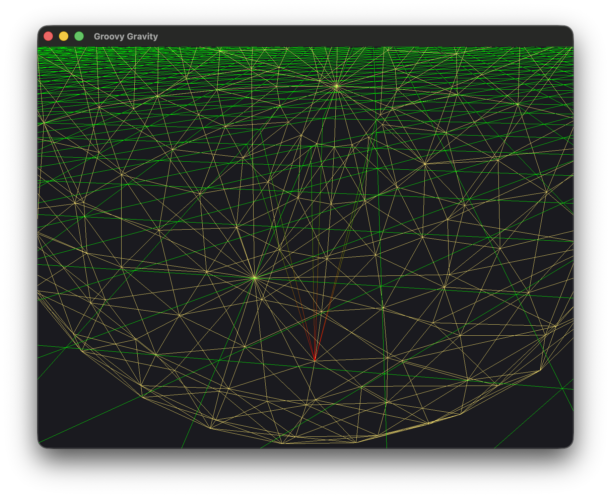

Could it be that the units used in the formula (meters), and the units defining my sphere (I thought they were meters) are not the same?
Let's check what values the vertices of the spaceTime mesh are

[-5, 0, -5, 1, 1, 1, -5, 0, -4, 1, 1, 1, -5, 0, -3, 1, 1, 1, -5, 0, -2, 1, 1, 1, -5, 0, -1, 1, 1, 1 ...]

Yeah well that seems about right, the values are not close to zero or anything ({1, 1, 1} is just the color).
Ì'm lost.

It also seems like the units for the spacetime mesh are the same as the ones for the sphere, because when I generate a 
mesh with size 10, it perfectly fits the sphere.

Hmmmmmm, it seems like rs is always smaller than 0: 
```c++
double rs =  2 * G * objects[0].x / c2;
if (rs < 1e-3) {
    c = vec3(0.0, 1.0, 1.0);
}
```
This does indeed color the mesh cyan. Interesting because it should be close to 5 with the values we are using.

I FOUND IT, when i wrote the lambda function to send the objects to the shader, i forgot an "s" at "objects"...... oops 😶‍🌫️
```c++
auto sendObjectToSpaceTimeShader = [&spaceTimeShader](Object& object, int id) {
    spaceTimeShader.setVec3("objects[" + std::to_string(id) + "]", glm::vec3(object.getMass(), object.getX(), object.getZ()));
};
```

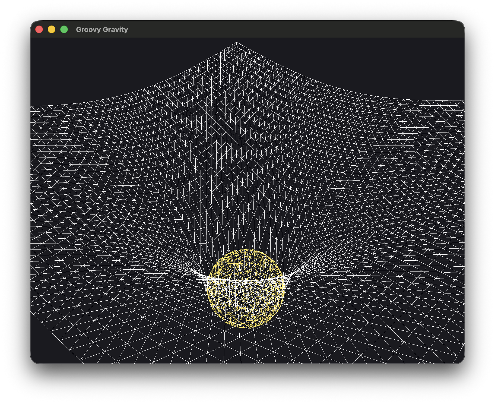

Alright, now I'd like to be able to have multiple objects that each curve spacetime. For this, I need to change the formula a
little bit, because currently, it only curves spacetime at the origin, regardless of the position of the object: example with a
second object that has the same mass as the first one, but twice the radius:

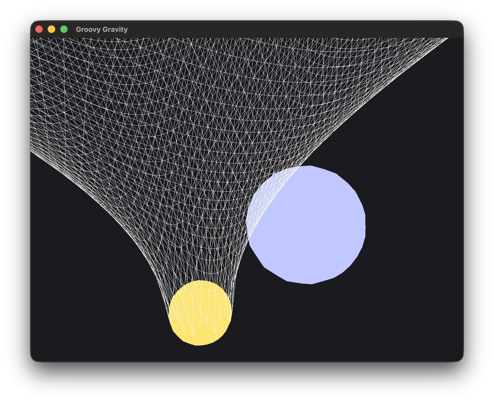

Clearly, spacetime is bent twice in the same location. Here is my first attempt: we do a change of coordinates:
```c++
uniform vec3 objects[2];    // x: mass, y: x, z: z
[...]
float x = pos0.x - objects[i].y;
float y = pos0.z - objects[i].z;
float x2 = x * x;
float y2 = y * y;
```

It looks alright, but there seems to be something missing, because it stops before it can reach the objects
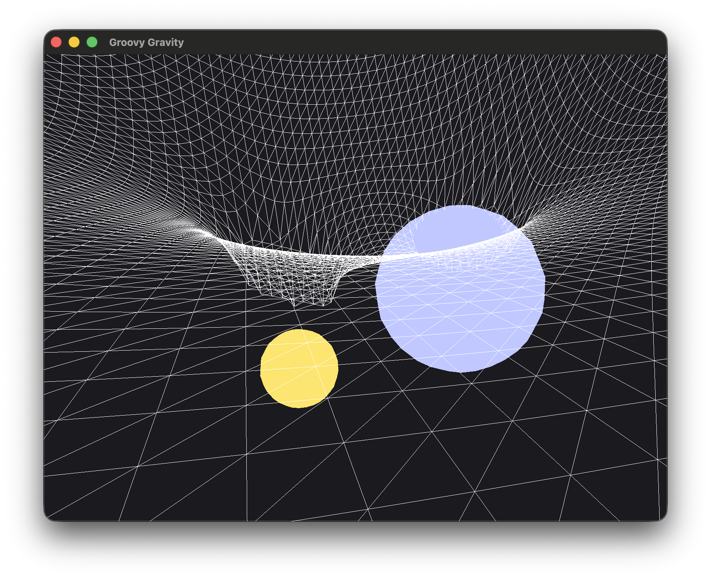

I'm also not too sure how to choose the masses and the radii. In real life, the sun's radius is much larger than the associated $r_s$
For now, I think i'll keep objects that have a radius that is exactly $r_s$. This means for the second mass, we need to reduce its mass:

$mass = c^2 r_S/2G = 6.73295 * 10^{27}$

Twice as massive, who would've thought. I think I'd rather have an object that's half the radius and half the mass in the end.

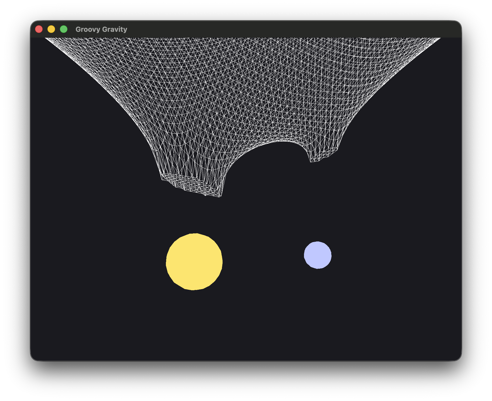
Now it's a bit clearer. It looks like there's just an offset. Maybe it's because there is a "static" component to the curvature
that is then being added twice (for each object). 

Maybe Flamm's paraboloid is not additive. annoying

Also, [this article](https://physics.stackexchange.com/questions/561289/shape-of-curved-spacetime#:~:text=However%2C%20it%20should,as%20in%20space.) says that
Flamm's paraboloid only describes space, and not spacetime. That is fine for our visualization I think

Maybe Flamm's paraboloid isn't what we need in the end? Also, I have no idea how it'll help us to then have objects follow the gravity field.

## 23/06
Coucou. I think today I want to do something else than Flamm's paraboloid. Like work on the actual forces that the objects
will undergo. I'll start with some research.

Hm, ok, so first, [this article](https://en.wikipedia.org/wiki/Einstein_field_equations#:~:text=As%20well%20as%20implying%20local%20energy–momentum%20conservation%2C%20the%20EFE%20reduce%20to%20Newton's%20law%20of%20gravitation%20in%20the%20limit%20of%20a%20weak%20gravitational%20field%20and%20velocities%20that%20are%20much%20less%20than%20the%20speed%20of%20light.[4]) tells us that 
the Einstein Field Equations reduce to Newton's law of gravitation for weak gravitational fields and speeds that are much lower than the 
speed of light.

Hmm, ok, so [this](https://en.wikipedia.org/wiki/Geodesics_in_general_relativity#:~:text=geodesic.-,In%20general%20relativity%2C%20gravity,dimensional%20(3%2DD)%20space) tells us that an object follows a geodesic curve.
What i think I understood, is that matter curves spacetime, and it creates geodesic curves, which are straightlines that are followed by other objects. So gravity
is not a force. The objects just follow a set path. I guess we now have two problems:
- How does matter curve spacetime (Flamm's paraboloid was just a visualization)
- How to compute the geodesic curve for a given object, given the curvature of spacetime

So first, we need to understand how matter curves spacetime. According to the wikipedia article on Einstein's Field Equations,
> Einstein field equations (EFE; also known as Einstein's equations) relate the geometry of spacetime to the distribution of matter-energy within it.[1]

So Einstein's Field Equations tell us how spacetime is curved, given the masses in it?

Sidenote, this is also pretty cool

> Exact solutions for the EFE can only be found under simplifying assumptions such as symmetry. Special classes of exact solutions are most often studied since they model many gravitational phenomena, such as rotating black holes and the expanding universe.

Ok, I read the article, but I still don't understand how to use this equation. I read [this](https://physics.stackexchange.com/questions/179082/laymans-explanation-and-understanding-of-einsteins-field-equations)
but it didn't help me. I am confused.

So, i'm currently watching [this video](https://www.youtube.com/watch?v=Xb7lSJ1E52E). It's the same guy as before for the flamm paraboloid,
what a goat. We can write the EFEs as

$R_{\mu\nu} - \frac{1}{2}Rg_{\mu\nu}+\Lambda g_{\mu\nu} = \frac{8\pi G}{c^4}T_{\mu\nu}$

Where:
- $R_{\mu\nu}$: Ricci tensor
- $R$: Ricci scalar: trace of the Ricci tensor
- $g_{\mu\nu}$: Metric tensor
- $\Lambda$: Cosmological constant
- $T_{\mu\nu}$: Stress energy momentum tensor

This equation tells us how mass and energy (which are in the Stress-energy-momentum tensor) are related to the curvature 
of spacetime (which is the left part of the equation).
The tensors are $4\times 4$ tensors, but they are symmetric, so only 10 different components. Also, the Ricci tensor is derived
from the metric tensor, so if we know the metric tensor, we can know the Ricci tensor (but the calculations are complicated), cool.

Aah, he says that typically, the way to solve the equations is to know the stress-energy tensor (because we know the distribution of mass),
and to use it to determine the metric tensor. This is more clear, because for some reason, up to now i didn't understand how to 
calculate this metric tensor. And since the metric tensor essentially gives us the spacetime geometry, it is what we want I suppose

OMG, i just understood the entire point of the metric tensor: so that's great, it's a tensor, but then what? Well, this tensor
tells you how to calculate distances between points on a spacetime surface.

Ah, that's great, in the video he even gives the line element (which is the distance metric essentially), for a vacuum outside 
a spherically symmetric non-rotating mass M:

$ds^2 = -(1-r_S/r) c^2 dt^2 + \frac{dr^2}{1-r_S/r} + r^2 \sin^2{(\phi)}  d\theta^2 + r^2 d\phi^2$

This is called the exterior Shwarzchild solution. And I also declare that [the sun doesn't rotate](https://en.wikipedia.org/wiki/Solar_rotation#:~:text=The%20solar%20rotation%20period%20is%2025.67%20days%20at%20the%20equator)

Hmm, but there is also a solution for masses that do rotate. The solution is the Kerr metric

Yeah, i watched [this](https://www.youtube.com/watch?v=5_79m-kHxts), but i don't understand anything, incomprehensible

Ok, I more or less figured out what to do. I can compute the next step of the orbit using the Schwarzchild geodesic equation. I will implement it in a shader, but basically,
step by step, i can do
```c++
void Object::orbitAround(const Object& object) {
    auto r = [*this, object] () {
        return std::sqrt(pow(x - object.getX(), 2) + pow(y - object.getY(), 2) + pow(z - object.getZ(), 2));;
    };

    double distance = r();
    double gm = config::physics::G * object.getMass();
    double h = 1;
    double c2 = config::physics::c * config::physics::c;
    double A = gm / (distance * distance) + (3 * gm * h * h) / (c2 * pow(distance, 4));
    double dx = x - object.getX();
    double dy = y - object.getY();
    double dz = z - object.getZ();
    vx = vx - A * dx/distance * config::physics::dt;
    vy = vy - A * dy/distance * config::physics::dt;
    vz = vz - A * dz/distance * config::physics::dt;

    x += vx * config::physics::dt;
    y += vy * config::physics::dt;
    z += vz * config::physics::dt;
}
```
$h$ is supposed to be the angular momentum per unit mass, so not 1. But already, i can figure out what i need to send to the object
shader to make this work. Essentially, i need, for all objects:
- their positions x, y, z
- their mass
- their velocities vx, vy, vz
- the angular momentum, which is a constant, and can be derived from the rest: 
  - $h^2 = ((y * v_z) - (z * v_y))^2 + ((x * v_z) - (z * v_x))^2 + ((x * v_y) - (y * v_x))^2 $
  - It seems like it shouldn't be constant, but there is conservation of angular momentum
  - might as well precompute it and send it to the shader
  - So, we will need some initial velocity, which also makes sense, otherwise the masses would just go towards each other which wouldn't be super interesting

Looks like that's it, so, we need 8 values per object. We'll use a mat3 per object

This code needs to be slightly adapted for the case where there are multiple masses.

## 24/06
We continue. yesterday i was having issues, because there is a problem that the state of an object after a state should be
saved to compute the next state (basically, the positions and velocities should be updated). This is a problem because the computation
is done in a shader, and I can't easily save the values. In openGL, there are compute shaders which are made for this, but since I
am using an older version to be able to run it on mac, this solution doesn't exist. I am not too sure what to do, because we need to 
save some computations.

This technique is called ping-pong rendering.

I got tired and made a function to compute the orbit on the CPU, and then i guess i just need to send the updated positions to the GPU

It doesn't work but i think the problem is with the scale of the values. I need to modify the code to use
real values for physics, but scale everything down only for the visualization.


## 25/06
Let's scale everything today. We need to pass over the entire code, make sure the units are correct, and then we'll decide of a scale.
This also means that the trick we were using to use floats by expressing the masses in millions of kg has to go. A bit unfortunate
but it'll make everything simpler if we just use real coordinates I think (I hope).

While I'm at it, I will comment every function with a block comment. I'm also adding a struct to describe the celestial bodies and
making it easier to create objects. Once i'm done doing this, I also need to rename the Object class to CelestialBody, it's clearer

The scaling down looks alright, but we need to scale down the radii much less than the distances, otherwise, we don't see the earth anymore. I'll do 2 separate scale down factors

We have movement!!!
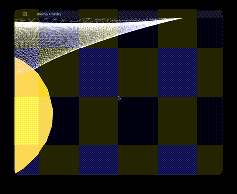

The earth is very tiny, and I am not sure we see it due to the compression of the gif, but I can tell you that it is not moving. I don't know why.
It should also spawn with some speed already. I think i'm going to make it so the `orbit` function doesn't update the positions
of the objects, but just the velocities, and have a function in the Object class to move the objects

Also, in the gif above, I massively increase the dt to 1 million seconds it was just to see if something happened
It looks like the Earth's velocity is reset to zero somewhere. It does start non zero, but goes to zero immediately:
```
Sun:
---- Position ----
X (real): 17229.9, (sim): 1.72299e-05
Y (real): 0, (sim): 0
Z (real): 0, (sim): 0
---- Velocity ----
Vx (real): 0.0172299, (sim): 1.72299e-11
Vy (real): 0, (sim): 0
Vz (real): 0, (sim): 0

Earth:
---- Position ----
X (real): 1.521e+11, (sim): 152.1
Y (real): 0, (sim): 0
Z (real): 0, (sim): 0
---- Velocity ----
Vx (real): 0, (sim): 0
Vy (real): 0, (sim): 0
Vz (real): 0, (sim): 0

FALLBACK (log once): Fallback to SW vertex processing because buildPipelineState failed
FALLBACK (log once): Fallback to SW vertex processing, m_disable_code: 1000
FALLBACK (log once): Fallback to SW vertex processing in drawCore, m_disable_code: 1000
dx: 1.521e+11, dy: 0,dz: 0
f: 5.8004e+19
Sun:
---- Position ----
X (real): 51689.6, (sim): 5.16896e-05
Y (real): 0, (sim): 0
Z (real): 0, (sim): 0
---- Velocity ----
Vx (real): 0.0344597, (sim): 3.44597e-11
Vy (real): 0, (sim): 0
Vz (real): 0, (sim): 0

Earth:
---- Position ----
X (real): 1.521e+11, (sim): 152.1
Y (real): 0, (sim): 0
Z (real): 0, (sim): 0
---- Velocity ----
Vx (real): 0, (sim): 0
Vy (real): 0, (sim): 0
Vz (real): 0, (sim): 0
```

Hmm, maybe because the velocity we give it is in the x axis, which is the shared axis with the sun? I'll give it the velocity on the y axis, it makes sense anyway
```
Sun:
---- Position ----
X (real): 17229.9, (sim): 1.72299e-05
Y (real): 0, (sim): 0
Z (real): 0, (sim): 0
---- Velocity ----
Vx (real): 0.0172299, (sim): 1.72299e-11
Vy (real): 0, (sim): 0
Vz (real): 0, (sim): 0

Earth:
---- Position ----
X (real): 1.521e+11, (sim): 152.1
Y (real): 2.978e+10, (sim): 29.78
Z (real): 0, (sim): 0
---- Velocity ----
Vx (real): 0, (sim): 0
Vy (real): 29780, (sim): 2.978e-05
Vz (real): 0, (sim): 0

FALLBACK (log once): Fallback to SW vertex processing because buildPipelineState failed
FALLBACK (log once): Fallback to SW vertex processing, m_disable_code: 1000
FALLBACK (log once): Fallback to SW vertex processing in drawCore, m_disable_code: 1000
dx: 1.521e+11, dy: 2.978e+10,dz: 0
f: 5.58625e+19
Sun:
---- Position ----
X (real): 50744.3, (sim): 5.07443e-05
Y (real): 3188.39, (sim): 3.18839e-06
Z (real): 0, (sim): 0
---- Velocity ----
Vx (real): 0.0335144, (sim): 3.35144e-11
Vy (real): 0.00318839, (sim): 3.18839e-12
Vz (real): 0, (sim): 0

Earth:
---- Position ----
X (real): 1.521e+11, (sim): 152.1
Y (real): 5.956e+10, (sim): 59.56
Z (real): 0, (sim): 0
---- Velocity ----
Vx (real): 0, (sim): 0
Vy (real): 29780, (sim): 2.978e-05
Vz (real): 0, (sim): 0

dx: 1.521e+11, dy: 5.956e+10,dz: 0
f: 5.02923e+19
Sun:
---- Position ----
X (real): 98169.3, (sim): 9.81693e-05
Y (real): 11824, (sim): 1.1824e-05
Z (real): 0, (sim): 0
---- Velocity ----
Vx (real): 0.047425, (sim): 4.7425e-11
Vy (real): 0.00863558, (sim): 8.63558e-12
Vz (real): 0, (sim): 0

Earth:
---- Position ----
X (real): 1.521e+11, (sim): 152.1
Y (real): 8.934e+10, (sim): 89.34
Z (real): 0, (sim): 0
---- Velocity ----
Vx (real): 0, (sim): 0
Vy (real): 29780, (sim): 2.978e-05
Vz (real): 0, (sim): 0
```

Cool, now the velocity isn't going to zero anymore, but it looks like it's still constant, and the earth just blasts off 
the screen after a couple of timesteps. Actually, if we give it in `vy`, the Earth starts going up, which is not really what I want.
I'll set it to `vz`. Still doesn't work. I don't get it.

Ok, i had made a mistake in the `orbit` function, for the second object, i was updating 3 times the same velocity component:
```
o2.setVx(o2.getVx() + ax2 * config::physics::dt);
o2.setVx(o2.getVy() + ay2 * config::physics::dt);
o2.setVx(o2.getVz() + az2 * config::physics::dt);
```

Let's see now that it's fixed. Hmm, for some reason, the earth still blasts off. Maybe the orbit isn't stable. I'll also give it some
velocity towards the sun. Give it some non zero velocity in the negative x direction. I'll make the earth slightly bigger because it's too hard to see it. This 
changes the orbit behavior, but it's just to see for now.

Yeah no, it looks like the earth doesn't care about the sun at all, it just goes off the screen. Its velocities are barely updated. I don't get it.
It's weird because the sun does appear to be moving towards Earth, but not the opposite. But the sun is much more massive than the earth, so if anything,
it should be the opposite.

Ok, i had a sign error in the accelerations for earth, let's see now. Nope, still just goes away.

I'll transform everthing to floats, and also I will compute hsq a single time, since it's supposed to be a constant. Maybe it's not constant in our simulation
and the orbit breaks? We will just use floats in the shaders.

I extracted hsq computation, but it appears we might have an issue:
```
dx: 1.521e+11, dy: 0,dz: 0
f: 7.52604e+224
dx: -7.89009e+206, dy: -1.55867e+114,dz: 7.445e+07
f: 0
```

The force is super super strong, and the objects go directly out of sight. wth. But like i copied the hsq definition into a function
that's it...

Uhhh, i had the wrong mass for the sun. I think it's because I had computed the mass i needed for having R_s = 5 back in the day

O M G, that was it!! the orbit now semi works !! The earth goes through the sun though.
I'll try removing the velocity component i gave in Z. For the scales, maybe i should have a scale that is per-object. Because to get the 
correct orbit, we need the right radius, but with the right radius, we see nothing...

Ok, if i give zero velocity in `x`, everything becomes a NaN immediately, i'll keep a small velocity component for now.

I'll push for now, this is good already
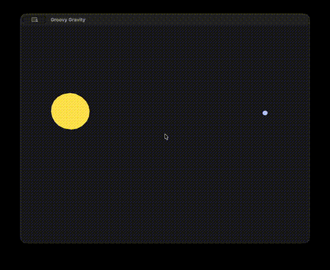

Hmm, if I use the right radius for the earth, everything is a NaN as well...

Wait, but that doesnt make any sense... When the earth's radius is set to `63710000.0f`, everythign works fine, the force at the 
first time step is `3.42702e+22`. But when I set the earth's radius to its actual radius, which is `6371000.0f`, the force at the first
time step is... `inf`??

Wait nevermind, for some reason I tried again and the right radius now doesn't produce `inf`. Must've been the wind 😶‍🌫️..

Ok, but when I do use the right radius, I don't see anything, and I suspect that the earth shoots super far... Let's set up a per-object
scale for radii. Even better, I could just set a radius, and a separate renderRadius directly.

Cool, I set it up, and now there's NaNs everywhere. Wtf is happening, the radius isn't even used anywhere, it's not needed 
for anything, why even have a render radius, when the actual radius is useless. And why is everyting NaN.

Ok, i'm not crazy

When I run the same code multiple times, sometimes it produces NaNs, and sometimes not. This is an interesting behavior,
and I cannot wait to debug it tomorrow 🥸 🤡

Yeah ok wtf, i tried like 5 times in a row and it worked fine, and then I removed a print and now it doesn't work anymore

why does everything change depending on if there are prints or not

I think it's a cleaning issue, let's just compile this code with commands

When i compile it like this:
```
rm -rf build && cmake -S . -B build && cmake --build build --target GroovyGravity; 
./build/GroovyGravity
```

it doesn't work. There were values, but a gray screen. Then i added this
```
set(COMPILER_FLAGS -O3 -march=native)
target_compile_options(${PROJECT_NAME} PRIVATE ${COMPILER_FLAGS})
```
to the CMake, and now there are NaNs everywhere. Ok, I added a clean step before the build step in CLion' play button. Maybe it'll work.
I don't understand why compiling it manually produces NaNs, and it's a shame too, because usually Clion is much slower.

This is just great: if you compile with `-fsanitize=address,undefined`, it doesn't go to NaNs anymore, but when you remvoe the flag
it goes to NaN.

If I add this 
```
if (std::isinf(f2) || std::isnan(f2)) {
    std::cout << "CRITICAL ERROR: Distance was " << r << ", Mass1: " << mass1 << ", Mass2: " << mass2 << std::endl;
    exit(1);
}
```
right after the computation of `f`, it exits. But if I add it after having printed `f`, then it doesn't exit. Whattttt

Ok... I removed the `inline` keyword for the orbit function, and not it works with this command:
```
rm -rf build && cmake -S . -B build && cmake --build build --target GroovyGravity -j && ./build/GroovyGravity;
```

But for some reason, the camera is super slow again, and it is not looking at the system when spawning. Cool now i changed the 
speed of the camera, and the distances are infinite again..... This will never end

I suspect that doing `rm -rf build && cmake -S . -B build` doesn't delete the build dir

For some reason I had a stale double loop in main that i now removed. It doesn't help with the Earth being eaten by the sun but w/e

I mean look at this
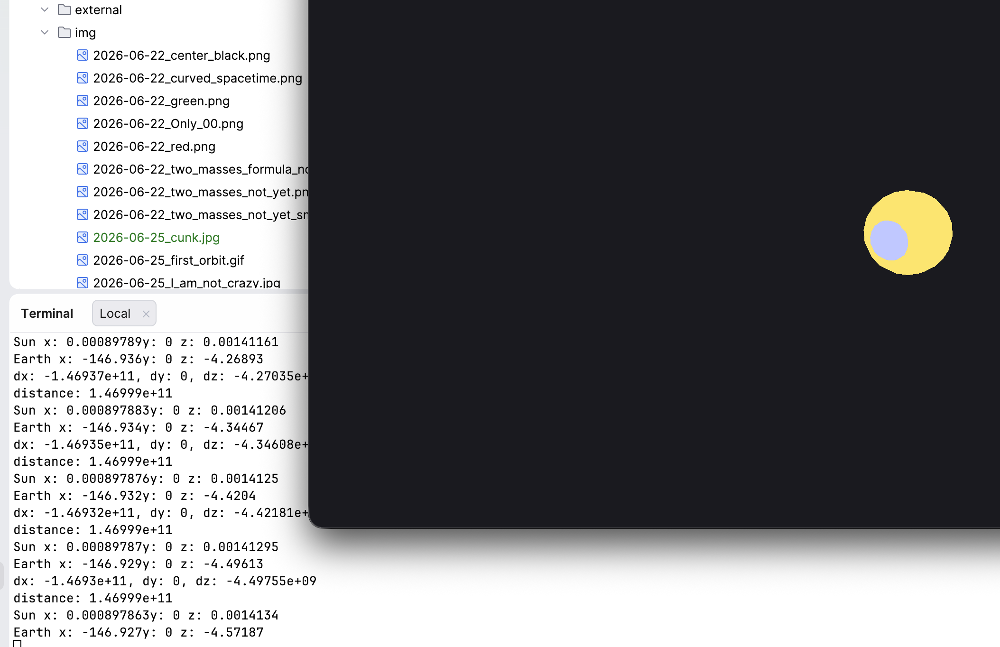
The two objects are clearly overlapping, but the sun's x position is allegedly close to zero, while the earth's is -146.
The positions are printed with this code: 
```
cout <<  "Sun x: " << scaleDistanceForRender(sun.getX()) <<  "y: "  << scaleDistanceForRender(sun.getY()) << " z: " <<scaleDistanceForRender(sun.getZ()) << endl;
cout <<  "Earth x: " << scaleDistanceForRender(earth.getX()) <<  "y: "  << scaleDistanceForRender(earth.getY()) << " z: " <<scaleDistanceForRender(earth.getZ()) << endl;
```
So that should correspond to what is sent to the shader. I tried fixing it by just using the model matrix but it doesn't work... The model matrix
is supposed to be used to translate objects, rotate and scale them, so i thought that it would be the perfect thing, but no.

THERE WE GO, IT WORKS!!! we had to remove the offset here 
```
float xp = renderX + renderRadius * cos(phi) * cos(theta);
float yp = renderY + renderRadius * cos(phi) * sin(theta);
float zp = renderZ + renderRadius * sin(phi);
```
had to be changed to 
```
float xp = renderRadius * cos(phi) * cos(theta);
float yp = renderRadius * cos(phi) * sin(theta);
float zp = renderRadius * sin(phi);
```
because now the offsets are handled by the code of course...

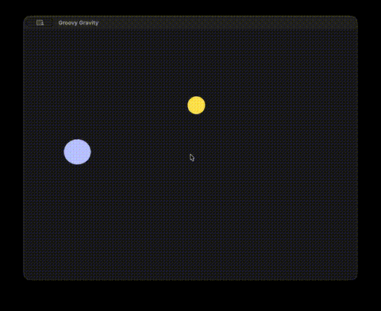

## 26/06
Today, I would like to work on the camera system. I would like to modify it: instead of moving with WASD, i'd like to
be able to click on an object, have it always be the center of the camera, be able to move around that center with the mouse,
and scroll to zoom/unzoom. And you should be able to click on another object to change the view to that object.

I don't know how to do it though. I guess maybe i can start with trying to have the camera look at a certain position all the time.
Maybe [this](https://learnopengl.com/Getting-started/Camera) can help me. Definitely helps a lot. I think what we want is to
be at a given distance from the object we are looking at. So basically, we know the target, and we compute the camera's position from it.
For example, the position could be 50 units higher, and 50 units out from the radius if that makes sense.
Essentially, the only thing we need to specify is the distance indeed, and then, with the mouse, we can control where we are on the
sphere that has a radius the size of the distance.

For now, i'll just set a default distance and position on the radius.

Cool, the fixed camera seems to work now. I only need to add the panning with the mouse/trackpad, and the scrolling to zoom/dezoom. 
Also the change of target with the click, but that's last, because i suspect it'll be more complicated.

I was a bit confused at firts, but everything is working: here i set the camera to track earth, and it looks like the sun is orbiting,
but that's normal, we just changed the reference
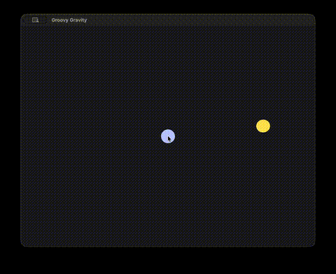